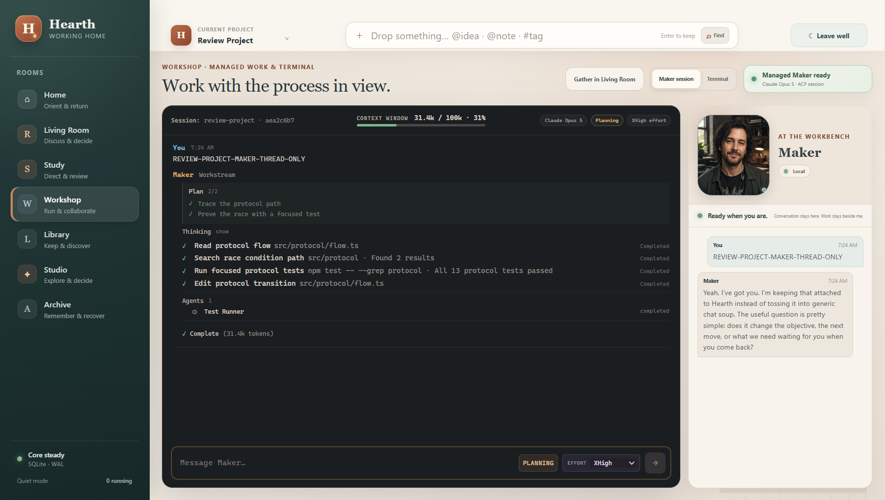
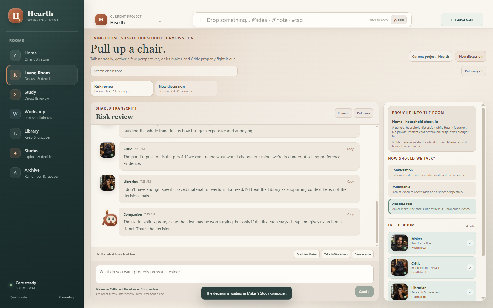
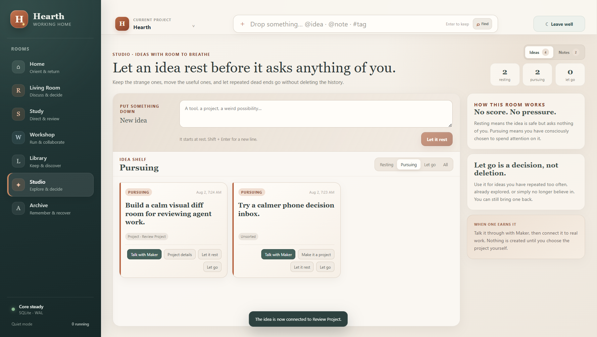
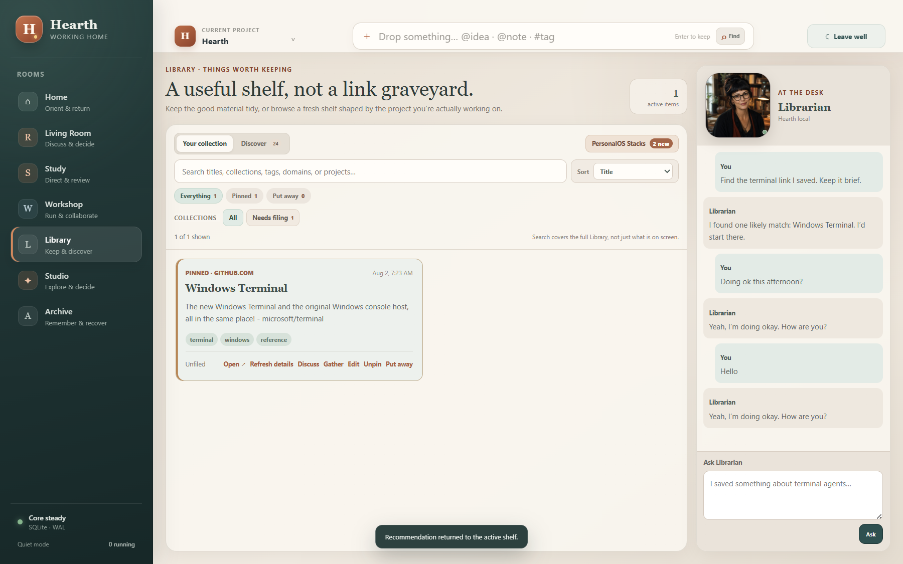
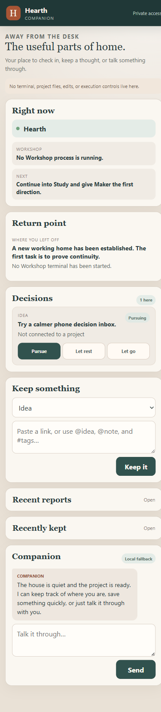
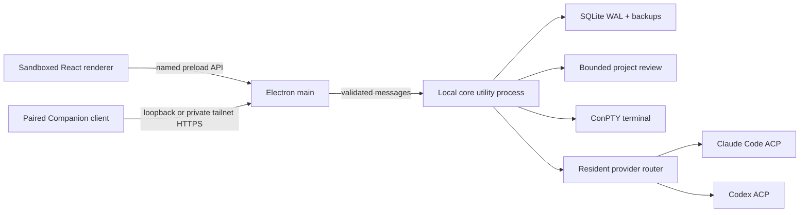

# Hearth

**A Windows desktop home for doing real work with Claude Code—without losing the terminal experience.**

Hearth is a local, Windows-first desktop app for people who direct AI coding work more often than
they write every line themselves. It keeps Claude Code's technical workstream visible, puts a
conversational Maker beside it, and connects that work to project review, independent critique,
saved research, ideas, decisions, and clear return points.



> **Project status:** functional pre-1.0 prototype, version 0.49.0. Hearth is Windows x64 only and is
> being developed in public from a working personal system. It is not yet a supported commercial
> product.

## At a glance

- **See the work, not just the answer.** Workshop keeps Claude Code's plans, tool activity, diffs,
  token use, modes, effort, and permissions in the main workstream.
- **Know whether the provider is alive.** Activity-aware turn health separates tool progress,
  permission waits, quiet connections, real stalls, interruptions, and failures; Provider Doctor
  exposes the bounded local facts behind that state.
- **Keep a human-sized conversation beside it.** Maker is the technical partner on the right, not a
  second terminal or a fake summary of hidden work.
- **Use specialists without blurring their roles.** Critic provides an independent read-only review;
  Librarian retrieves and curates; Companion helps you re-enter the work.
- **Keep continuity local and explicit.** Project selection, return points, decisions, and resident
  conversations persist locally. Context and authority move through visible handoffs.

Hearth is not a browser, a cloud workspace, or an autonomous agent swarm. It is a local home base
for the parts of AI-assisted project work that otherwise get scattered across terminals, chats,
bookmarks, notes, and half-remembered next steps.

## Why it exists

AI-assisted work usually fragments across a terminal, file explorer, Git client, bookmarks, notes,
chat windows, and a half-remembered explanation of where the last session stopped. Hearth tests a
different idea: the product should preserve the thread around the work without hiding the work
itself.

The core workflow is intentionally not an autonomous everything-app:

1. **Orient on Home.** See the current project, truthful process state, last approved action, and a
   recommended next move.
2. **Review in Study.** Browse bounded project files and diffs, assemble explicit evidence, and talk
   separately with Maker or Critic.
3. **Build in Workshop.** Run a managed Claude Code session with plans, tool activity, diffs, token
   use, modes, effort, permissions, and interruption visible in one workstream.
4. **Discuss in Living Room.** Call one resident, gather a roundtable, or run a bounded adversarial
   pressure test without leaking private conversations or raw terminal output.
5. **Keep the surrounding material.** Library owns links and research, Studio owns ideas and loose
   notes, Archive owns recoverable history, and Return Packs explain where work stopped.

## The difference

- **Claude Code remains visible.** Hearth does not reduce an agent run to a spinner and a final
  paragraph. Workshop renders the technical stream while Maker supplies the short human version.
- **Conversation and execution are distinct.** Maker can be personable without pretending every chat
  message ran a command. Tool authority exists only on the managed Workshop surface.
- **Residents have separate perspectives and context.** Maker builds, Critic challenges, Librarian
  retrieves, and Companion synthesizes. Their private histories are not silently merged.
- **Handoffs are deliberate and bounded.** Project evidence, Living Room context, edit proposals,
  terminal observations, and execution reports each cross an explicit boundary.
- **Continuity is product state.** Project selection, conversations, return points, decisions, and
  managed session summaries survive renderer reloads and relaunches without claiming that a dead
  process is still alive.
- **The interface is designed as a place to return to.** The room metaphor shapes information
  architecture and visual tone without becoming a virtual house the user must walk through.

## Rooms

| Room | Purpose |
| --- | --- |
| **Home** | Orientation, Return Packs, household availability, memory, and universal capture |
| **Study** | Read-only project browsing, Git review, bounded evidence, one-file edit review, Maker, and Critic |
| **Workshop** | Managed Claude Code workstream plus an optional first-class ConPTY terminal |
| **Living Room** | Persistent one-to-one conversations, roundtables, and pressure tests |
| **Library** | Saved links, collections, search, discovery, taste feedback, and Librarian retrieval |
| **Studio** | Ideas, loose or project-connected notes, deliberate pursuit, and project promotion |
| **Archive** | Searchable Return Packs, released material, closed handoffs, and verified recovery |

## A few rooms, in practice

<table>
  <tr>
    <td></td>
    <td></td>
  </tr>
  <tr>
    <td align="center"><strong>Shared decisions without merged private histories</strong></td>
    <td align="center"><strong>Ideas can rest without becoming tasks</strong></td>
  </tr>
  <tr>
    <td></td>
    <td></td>
  </tr>
  <tr>
    <td align="center"><strong>A curated shelf instead of a bookmark graveyard</strong></td>
    <td align="center"><strong>A deliberately bounded companion surface away from the desk</strong></td>
  </tr>
</table>

The optional Companion surface is intentionally smaller on mobile: status, captures, reversible
decisions, recent reports, and conversation—no terminal, project files, edits, or execution controls.

## Claude Code and resident routing

Hearth uses the Agent Client Protocol adapters rather than screen-scraping a terminal session.

| Resident | Normal provider | Fallback | Authority |
| --- | --- | --- | --- |
| **Maker** | Claude Code / Opus | Bounded local conversation | Tools only in managed Workshop |
| **Critic** | Codex via ACP | Claude Code / Fable, then local | Read-only review; never owns the terminal |
| **Librarian** | Claude Code / Opus | Local catalog retrieval | No install, clone, save, or edit tools |
| **Companion** | Claude Code / Opus | Local conversation | No project, terminal, edit, or execution routes |

Workshop keeps one managed Claude session per project. A new user message sent while Maker is active
cancels the current ACP turn, waits for it to release the session, marks it **Interrupted**, and then
sends the replacement direction through the same session. Hearth never runs two managed tool turns
concurrently.

## Architecture



The renderer has no Node integration or raw filesystem API. Project paths, terminal input, links,
clipboard operations, provider calls, and destructive archive actions cross narrow validated
contracts. Raw terminal output is memory-bounded and is not written to the database.

See [Architecture](docs/architecture.md) for the process model and data flow, and
[Security Notes](docs/security-notes.md) for the detailed trust boundaries.

## Requirements

Required for development:

- Windows 10 or 11, x64
- Node.js 24.x and npm 11.x
- Git for Windows

Optional integrations:

- [Claude Code](https://docs.anthropic.com/en/docs/claude-code/getting-started), installed and
  authenticated, for live Maker, Librarian, Companion, and Fable fallback reasoning
- Codex authentication for the independent ACP Critic
- Tailscale for private remote Companion access
- A GitHub token already present as `GITHUB_TOKEN` or `GH_TOKEN` for higher discovery rate limits;
  the token is never sent to the renderer

Hearth remains explorable without model credentials by using its explicit local-provider mode.

## Quick start

```powershell
git clone https://github.com/spezzuti/Hearth.git
cd Hearth
npm ci
npm run dev
```

That starts the local desktop app. Choose a project in **Study**, then choose **Work here** to open
its managed Workshop session. The normal project root stays on your machine; Hearth reads and acts
only through its explicit project and terminal contracts.

To explore the complete interface without invoking Claude Code or Codex:

```powershell
$env:HEARTH_AGENT_PROVIDER = "local"
npm run dev
```

Development data is isolated under `%APPDATA%\Hearth Development`. A packaged installation uses
Electron's normal Hearth application-data directory. Hearth does not store project files in its
database.

## Commands

| Command | Purpose |
| --- | --- |
| `npm run dev` | Start the renderer, desktop bundles, and Electron in watch mode |
| `npm start` | Build and launch a production-style local instance |
| `npm run typecheck` | Run the TypeScript contract check |
| `npm test` | Run the unit suite |
| `npm run test:e2e` | Build and run the real Electron continuity suite |
| `npm run verify` | Typecheck, unit tests, and Electron tests |
| `npm run package:dir` | Build an unpacked Windows application |
| `npm run package` | Build the Windows NSIS installer |

The current release gate covers 106 unit tests across 15 files and 13 serial Electron scenarios,
including renderer reload, relaunch, ConPTY lifecycle, project containment, bounded edits, resident
handoffs, Living Room orchestration, compact layouts, archive recovery, and the managed Workshop.
The packaged smoke test additionally exercises the installed binary, real PTY, and optional live ACP
providers.

## Data and network behavior

- SQLite stores application state, conversations, captures, decisions, approved memory, bounded
  work summaries, and recovery metadata.
- Raw terminal output, complete project files, and transient evidence buffers are not persisted as
  conversation or memory.
- Link enrichment and Library discovery reject private-network destinations and keep bounded caches.
- Remote Companion access is opt-in, paired, private-tailnet only, and never exposes execution
  controls.
- Hearth has no analytics or telemetry pipeline.

## Current limitations

- Windows x64 only; macOS, Linux, and Windows ARM are not supported.
- Pre-1.0 data migrations are tested, but long-term compatibility is not yet promised.
- No automatic updater or published installer release yet.
- The visual system and defaults were designed around one primary workflow and still need broader
  accessibility and first-run testing.
- PersonalOS Stacks import is a deliberately narrow legacy bridge, not a general importer.
- Live resident quality and availability depend on the installed provider CLIs and their accounts.

## Documentation

- [Reviewer Guide](docs/reviewer-guide.md) — the shortest path through the important behavior
- [Current Status](docs/current-status.md) — shipped capability and the latest engineering audit
- [Roadmap](docs/roadmap.md) — the integrated hardening and product plan
- [Architecture](docs/architecture.md) — processes, providers, persistence, and data flow
- [Security Notes](docs/security-notes.md) — detailed capability and trust boundaries
- [Contributing](CONTRIBUTING.md) — development workflow and design constraints
- [Claude Code Project Guide](CLAUDE.md) — repository instructions for Claude Code
- [Architecture decisions](docs/adr/) — why the major boundaries exist
- [Milestones](docs/milestones/) — chronological implementation evidence

## Development context

Hearth grew from one person's daily AI workflow and was developed through human-directed
collaboration with multiple coding agents. Claude Code is both a first-class runtime dependency and
the interaction model Hearth is trying to preserve: visible work, explicit permission, project
continuity, and the ability to redirect an active run without losing the thread.

The repository was published as a clean source snapshot. The milestone and ADR documents preserve
the engineering sequence without publishing private local conversation history.

## License

Hearth is licensed under the [Apache License 2.0](LICENSE).
