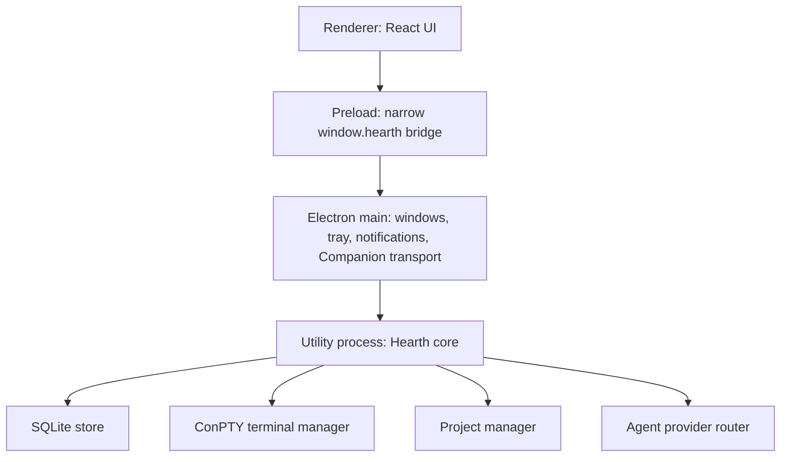

# Hearth architecture

This document describes the current 0.60.2 implementation. It is an implementation map, not a
future-state design.

## Process model

Hearth splits trusted work across three desktop processes.

### Renderer

The React renderer owns presentation and temporary UI state. It is sandboxed, has context isolation
enabled, and has no Node integration. It cannot read an arbitrary path, spawn a process, or access
SQLite directly.

### Preload and Electron main

The preload exposes named Hearth operations defined in `src/shared/contracts.ts`. Electron main
validates IPC senders, owns the desktop window, tray, notifications, guarded external navigation,
and the optional Companion HTTP/HTTPS transport. It forwards validated requests to the utility
process.

### Local core utility process

The core owns durable state and capabilities:

- SQLite migrations, queries, startup backups, and bounded retention
- project discovery, containment, file preview, Git review, and bounded edits
- ConPTY creation, attachment, input, resize, ownership, and shutdown
- resident prompting, ACP sessions, cancellation, and fallback routing
- Library discovery and link metadata retrieval
- typed web and GitHub reference recognition, canonicalization, and bounded public enrichment
- Living Room turn orchestration
- PersonalOS Stacks read-only import

Moving these capabilities out of the renderer keeps a disposable UI from becoming the authority for
paths, terminals, or model tools.

## Resident model

Residents are not four autonomous workers running in the background. They are four named
perspectives over explicit surfaces and bounded context.

| Resident | Primary role | Provider route | Capability ceiling |
| --- | --- | --- | --- |
| Maker | Builder and practical project partner | Claude Code ACP, configured for Opus | Tool work only inside managed Workshop |
| Critic | Independent skeptical reviewer | Codex ACP, then configured Claude Fable fallback | Read-only project diagnostics |
| Librarian | Retrieval, precedent, and collection judgment | Claude Code, configured for Opus | Bounded Library evidence; no mutations |
| Companion | Orientation and household synthesis | Claude Code, configured for Opus | Home context only; no project or terminal capability |

Local fallbacks are visible in the UI. They preserve basic personality and retrieval behavior but do
not pretend a model or tool action occurred.

Model identity also carries provenance. Hearth labels a configured alias as configured until ACP or
the bounded Claude transcript reports the model actually used. Codex is named as the provider, but
Hearth does not invent an underlying Codex model when the adapter does not disclose one.

## Workshop flow

1. The user browses any discovered project in Study without changing the current working project.
2. Choosing **Work in _project_** invokes one core-owned activation operation.
3. Core parks a live session belonging to another project, persists the target selection, and loads
   only the target project's own parked terminal identity.
4. Core resolves and revalidates the canonical project root.
5. Workshop opens or resumes the named Claude Code session stored for that project path in a Windows ConPTY.
6. xterm renders Claude Code's real TUI. Plans, thinking state, tool activity, diffs, permissions,
   modes, effort, token counters, and prompts come directly from Claude Code rather than a Hearth
   reconstruction.
7. Native terminal input—including Claude's modified-key protocol—is forwarded to that same process.
8. Maker is the personality of that visible Claude Code session. The side rail is a project notebook
   and presence layer; it does not create a second conversation or competing input surface.
9. Reviewed proposal controls can pass a bounded instruction into the same visible terminal.
10. Core persists terminal identity and resumability per project path, not raw PTY output.

Claude and Codex ACP integrations remain available for resident reasoning, Critic review, and bounded
household orchestration. They are not rendered as a second Claude-looking Workshop terminal.

## Project review and edits

The renderer addresses projects by persisted ID and files by relative path. Core resolves the real
path and verifies containment for every request. Project review is read-only by default.

A direct edit is deliberately narrow:

1. preview one eligible UTF-8 file;
2. draft changes in memory;
3. inspect the exact line diff;
4. explicitly apply;
5. atomically replace the file after a stale-hash check;
6. keep a private original-file backup for verified Undo.

Maker-proposed edits and Critic review use the same local edit engine and cannot bypass Apply.

## Living Room flow

Living Room maintains a project-separated shared transcript. A turn is one of:

- **Conversation:** one selected resident;
- **Roundtable:** two to four selected residents, once each in visible order;
- **Pressure test:** Maker, Critic, optional Librarian, and Companion in a fixed bounded sequence.

Context brought from Home, Study, Workshop, or Library is persisted as a visible label and bounded
summary. Private resident history, raw terminal output, and hidden source evidence are not copied
into the room.

## Persistence

SQLite WAL stores:

- application and route state;
- discovered-project metadata and current selection;
- resident and Living Room conversations;
- captures, collections, idea decisions, notes, and Archive state;
- canonical reference records, retrieval state, bounded public metadata, and project connections;
- approved House Memory, supervised House Practices, their bounded provenance, and dismissed
  suggestions;
- managed Workshop summaries, plans, activities, token state, context manifests, and session identity;
- Return Packs and bounded execution reports;
- edit recovery metadata and private backup references.

Not persisted as general history:

- raw terminal scrollback;
- arbitrary project file contents;
- complete evidence-search source;
- transient provider prompt buffers;
- clipboard contents;
- unapproved memory suggestions derived from conversation text—conversation mining is not performed.

## Network surfaces

Hearth has four intentional network paths:

1. installed Claude Code and Codex providers using their own authenticated clients;
2. public GitHub repository discovery;
3. guarded HTTP/HTTPS title and description enrichment plus bounded public GitHub entity metadata
   for a user-saved reference;
4. opt-in Companion access over loopback or private Tailscale HTTPS.

The renderer does not load remote scripts, styles, images, or arbitrary pages. Hearth has no
telemetry service.

## Source map

| Area | Primary files |
| --- | --- |
| Contracts | `src/shared/contracts.ts` |
| Core dispatch | `src/core/core.ts` |
| Persistence | `src/core/store.ts` |
| Reference recognition | `src/core/references.ts`, `src/core/link-metadata.ts` |
| Claude ACP | `src/core/claude-acp-runtime.ts` |
| Codex ACP | `src/core/codex-acp-runtime.ts` |
| Provider routing | `src/core/agent-provider.ts` |
| Terminal | `src/core/terminal.ts`, `src/core/terminal-observation.ts` |
| Projects and edits | `src/core/projects.ts` |
| Living Room | `src/core/living-room.ts` |
| Electron boundary | `src/main/main.ts`, `src/main/preload.ts` |
| Desktop UI | `src/renderer/src/` |
| Tests | `tests/unit/`, `tests/e2e/continuity.spec.ts` |

The complete capability limits are recorded in [security-notes.md](security-notes.md). Architectural
decisions are retained in [`docs/adr`](adr/).
